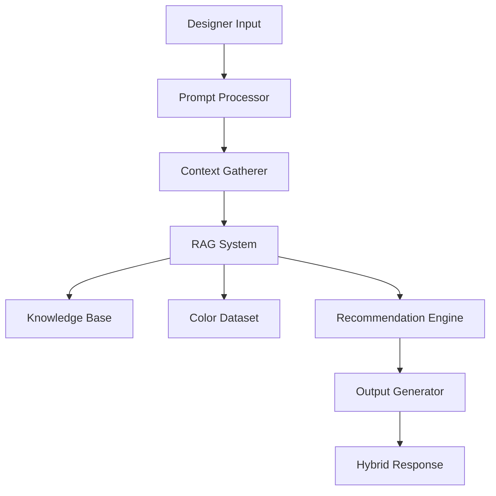

# Design Document: AI-Powered Design Assistant

## Overview

The AI-powered design assistant is a RAG-based system that provides contextual design guidance to designers through natural language interaction. The system combines curated design knowledge with intelligent context gathering to deliver personalized recommendations while maintaining designer creative control.

The architecture follows a modular approach with clear separation between input processing, knowledge retrieval, context management, and output generation. This design enables extensibility for future features like image uploads and Figma integration while maintaining hackathon-appropriate scope.

## Architecture

The system follows a pipeline architecture with the following high-level flow:



### Core Components

1. **Input Layer**: Handles natural language prompts and user interactions
2. **Context Layer**: Gathers and manages contextual information about design requirements
3. **Knowledge Layer**: RAG system with curated design knowledge and color datasets
4. **Processing Layer**: Applies design principles and generates recommendations
5. **Output Layer**: Produces hybrid text and JSON responses with source attribution

## Components and Interfaces

### Prompt Processor

**Purpose**: Processes natural language input and extracts design-related concepts.

**Interface**:
```typescript
interface PromptProcessor {
  processPrompt(input: string): ProcessedPrompt
  extractDesignConcepts(prompt: string): DesignConcept[]
  validateInput(input: string): ValidationResult
}

interface ProcessedPrompt {
  originalText: string
  extractedConcepts: DesignConcept[]
  confidence: number
  requiresContext: boolean
}

interface DesignConcept {
  type: 'color' | 'mood' | 'industry' | 'audience' | 'style'
  value: string
  confidence: number
}
```

**Responsibilities**:
- Parse natural language input
- Extract design-related keywords and concepts
- Determine if additional context is needed
- Validate input completeness and clarity

### Context Gatherer

**Purpose**: Collects additional contextual information through targeted questions.

**Interface**:
```typescript
interface ContextGatherer {
  identifyMissingContext(prompt: ProcessedPrompt): ContextGap[]
  generateQuestions(gaps: ContextGap[]): Question[]
  processContextResponse(response: string, question: Question): ContextItem
  isContextComplete(context: DesignContext): boolean
}

interface DesignContext {
  brandPersonality?: string[]
  targetAudience?: string
  industry?: string
  useCase?: string
  existingColors?: string[]
  moodKeywords?: string[]
  constraints?: string[]
}

interface Question {
  id: string
  text: string
  type: 'multiple_choice' | 'open_text' | 'color_picker'
  options?: string[]
  required: boolean
}
```

**Responsibilities**:
- Identify missing contextual information
- Generate relevant follow-up questions
- Process and validate context responses
- Determine when sufficient context is collected

### RAG System

**Purpose**: Retrieves relevant design knowledge from curated sources.

**Interface**:
```typescript
interface RAGSystem {
  searchKnowledge(query: string, context: DesignContext): KnowledgeResult[]
  rankResults(results: KnowledgeResult[], context: DesignContext): RankedResult[]
  extractRelevantPrinciples(results: RankedResult[]): DesignPrinciple[]
}

interface KnowledgeResult {
  content: string
  source: SourceMetadata
  relevanceScore: number
  principleType: 'color_theory' | 'typography' | 'layout' | 'ux_pattern'
}

interface SourceMetadata {
  title: string
  author?: string
  publication?: string
  url?: string
  credibilityScore: number
}

interface DesignPrinciple {
  name: string
  description: string
  application: string
  sources: SourceMetadata[]
}
```

**Responsibilities**:
- Search knowledge base using semantic similarity
- Rank results based on relevance and context
- Extract applicable design principles
- Maintain source attribution throughout process

### Knowledge Base

**Purpose**: Stores and manages curated design knowledge and color datasets.

**Interface**:
```typescript
interface KnowledgeBase {
  searchArticles(query: string): Article[]
  searchColorTheory(concepts: string[]): ColorTheoryPrinciple[]
  getDesignPatterns(category: string): DesignPattern[]
  validateSource(source: SourceMetadata): boolean
}

interface Article {
  id: string
  title: string
  content: string
  author: string
  tags: string[]
  credibilityScore: number
  lastUpdated: Date
}

interface ColorTheoryPrinciple {
  name: string
  description: string
  examples: ColorExample[]
  applicableContexts: string[]
}
```

**Responsibilities**:
- Store curated UI/UX articles and design books
- Maintain color theory principles and examples
- Provide efficient search and retrieval capabilities
- Validate source credibility and relevance

### Color Dataset

**Purpose**: Manages color information with mood, tone, and HSV values.

**Interface**:
```typescript
interface ColorDataset {
  findColorsByMood(mood: string[]): ColorMatch[]
  findHarmoniousColors(baseColor: string, harmony: HarmonyType): ColorPalette
  getColorPsychology(color: string): ColorPsychology
  validateColorAccessibility(colors: string[]): AccessibilityResult
}

interface ColorMatch {
  hex: string
  name: string
  hsv: HSVValue
  mood: string[]
  tone: 'warm' | 'cool' | 'neutral'
  usage: string[]
}

interface ColorPalette {
  primary: ColorMatch
  secondary: ColorMatch[]
  accent: ColorMatch[]
  neutral: ColorMatch[]
  harmonyType: HarmonyType
}

type HarmonyType = 'complementary' | 'analogous' | 'triadic' | 'split_complementary' | 'tetradic'
```

**Responsibilities**:
- Store comprehensive color information
- Apply color theory for palette generation
- Provide mood and psychological associations
- Validate color accessibility and contrast

### Recommendation Engine

**Purpose**: Synthesizes knowledge and context to generate design recommendations.

**Interface**:
```typescript
interface RecommendationEngine {
  generateRecommendations(
    context: DesignContext,
    principles: DesignPrinciple[],
    colors: ColorMatch[]
  ): DesignRecommendation[]
  
  applyDesignPrinciples(
    recommendations: DesignRecommendation[],
    principles: DesignPrinciple[]
  ): EnhancedRecommendation[]
  
  rankRecommendations(
    recommendations: EnhancedRecommendation[],
    context: DesignContext
  ): RankedRecommendation[]
}

interface DesignRecommendation {
  type: 'color_palette' | 'typography' | 'layout' | 'component'
  title: string
  description: string
  rationale: string
  confidence: number
  alternatives: Alternative[]
}

interface EnhancedRecommendation extends DesignRecommendation {
  appliedPrinciples: DesignPrinciple[]
  theoreticalBasis: string
  usageGuidelines: string[]
}
```

**Responsibilities**:
- Synthesize context, knowledge, and color data
- Apply design principles to generate recommendations
- Provide multiple options with clear rationale
- Rank recommendations by relevance and quality

### Prompt Engineering System

**Purpose**: Manages and optimizes prompts for different design tasks and contexts.

**Interface**:
```typescript
interface PromptEngineering {
  buildPrompt(task: PromptTask, context: DesignContext, knowledge: KnowledgeResult[]): EngineeredPrompt
  optimizePrompt(basePrompt: string, context: DesignContext): string
  validatePromptOutput(response: string, expectedFormat: OutputFormat): ValidationResult
  getPromptTemplate(type: PromptType): PromptTemplate
}

interface PromptTemplate {
  id: string
  name: string
  description: string
  systemPrompt: string
  userPromptTemplate: string
  outputFormat: OutputFormat
  examples: PromptExample[]
  validationRules: ValidationRule[]
}

interface EngineeredPrompt {
  systemPrompt: string
  userPrompt: string
  temperature: number
  maxTokens: number
  stopSequences?: string[]
  expectedFormat: OutputFormat
}

type PromptType = 'color_palette' | 'design_critique' | 'context_questions' | 'concept_extraction' | 'recommendation_synthesis'
```

**Responsibilities**:
- Manage prompt templates for different design tasks
- Dynamically inject context and knowledge into prompts
- Optimize prompts based on user context and previous interactions
- Validate LLM outputs against expected formats
- A/B test different prompt variations

### Output Generator

**Purpose**: Produces hybrid text and JSON responses with proper attribution.

**Interface**:
```typescript
interface OutputGenerator {
  generateHybridResponse(
    recommendations: RankedRecommendation[],
    sources: SourceMetadata[]
  ): HybridResponse
  
  formatTextExplanation(recommendations: RankedRecommendation[]): string
  formatStructuredData(recommendations: RankedRecommendation[]): StructuredOutput
  generateSourceAttribution(sources: SourceMetadata[]): Attribution[]
}

interface HybridResponse {
  textExplanation: string
  structuredData: StructuredOutput
  sourceAttribution: Attribution[]
  metadata: ResponseMetadata
}

interface StructuredOutput {
  colorPalettes: ColorPaletteOutput[]
  designPrinciples: PrincipleOutput[]
  usageGuidelines: UsageGuideline[]
  alternatives: AlternativeOutput[]
}

interface ColorPaletteOutput {
  name: string
  colors: {
    hex: string
    name: string
    role: 'primary' | 'secondary' | 'accent' | 'neutral'
    usage: string[]
    mood: string[]
  }[]
  harmonyType: HarmonyType
  accessibility: AccessibilityInfo
}
```

**Responsibilities**:
- Generate human-readable explanations
- Structure data for programmatic consumption
- Maintain proper source attribution
- Format responses for multiple use cases

## Data Models

### Core Data Structures

```typescript
// User interaction models
interface DesignRequest {
  id: string
  userId?: string
  originalPrompt: string
  context: DesignContext
  timestamp: Date
  status: 'processing' | 'complete' | 'error'
}

interface DesignSession {
  id: string
  requests: DesignRequest[]
  contextHistory: DesignContext[]
  preferences: UserPreferences
  createdAt: Date
  lastActivity: Date
}

// Knowledge representation models
interface KnowledgeDocument {
  id: string
  type: 'article' | 'book' | 'course' | 'pattern'
  title: string
  content: string
  metadata: SourceMetadata
  tags: string[]
  embeddings: number[]
  indexed: boolean
}

interface ColorEntry {
  hex: string
  name: string
  hsv: HSVValue
  rgb: RGBValue
  mood: MoodAssociation[]
  tone: ColorTone
  accessibility: AccessibilityRating
  culturalContext?: CulturalAssociation[]
}

// Response models
interface DesignResponse {
  id: string
  requestId: string
  recommendations: DesignRecommendation[]
  confidence: number
  processingTime: number
  sources: SourceMetadata[]
  generatedAt: Date
}
```

### Validation Rules

- All color values must be valid hex codes or named colors
- HSV values must be within valid ranges (H: 0-360, S: 0-100, V: 0-100)
- Confidence scores must be between 0 and 1
- Source metadata must include at minimum title and credibility score
- Context items must be validated against expected types and formats
- All timestamps must be in ISO 8601 format
- User preferences must conform to defined schema

## Correctness Properties

*A property is a characteristic or behavior that should hold true across all valid executions of a system—essentially, a formal statement about what the system should do. Properties serve as the bridge between human-readable specifications and machine-verifiable correctness guarantees.*

### Property 1: Natural Language Input Processing
*For any* text input provided by a designer, the Design_Assistant should successfully process the input without errors and extract any design-related concepts present in the text.
**Validates: Requirements 1.1, 1.2, 1.4, 1.5**

### Property 2: Context Gap Identification and Question Generation
*For any* design prompt that lacks sufficient context, the Context_Gatherer should identify the missing information and generate appropriate questions about brand personality, target audience, industry, use case, existing colors, and mood keywords.
**Validates: Requirements 2.1, 2.2, 2.3**

### Property 3: Clarification Request for Ambiguous Input
*For any* ambiguous or incomplete prompt, the Design_Assistant should request clarification through contextual questions rather than making assumptions.
**Validates: Requirements 1.3**

### Property 4: Context Storage and Utilization
*For any* context information collected during the interaction, the system should store it and utilize it consistently throughout the recommendation generation process.
**Validates: Requirements 2.4, 2.5**

### Property 5: Knowledge Retrieval and Prioritization
*For any* design request with context, the RAG_System should retrieve relevant design principles, color theory, UI/UX best practices, and design patterns, prioritizing the most applicable content based on the provided context.
**Validates: Requirements 3.1, 3.2, 3.3, 3.4**

### Property 6: Comprehensive Source Attribution
*For any* design recommendation or principle referenced, the system should maintain complete and accurate source attribution including citations, author information, publication details, and metadata throughout the entire process.
**Validates: Requirements 3.5, 6.1, 6.2, 6.3, 6.4, 6.5**

### Property 7: Color Theory Application
*For any* color palette generation request, the Design_Assistant should apply established color theory principles (complementary, analogous, triadic relationships) and consider HSV values, color harmony rules, and mood associations from the Color_Dataset.
**Validates: Requirements 4.1, 4.7**

### Property 8: Design Principle Integration
*For any* design recommendation, the system should reference established design principles (contrast, hierarchy, balance, visual flow) and provide theoretical justification for suggestions.
**Validates: Requirements 4.2, 4.5**

### Property 9: Contextual Alignment
*For any* set of recommendations generated, they should align with the specified brand personality, target audience, and use case using appropriate theoretical frameworks.
**Validates: Requirements 4.6**

### Property 10: Complete Color Palette Information
*For any* color palette generated, the output should include specific hex codes, descriptive names, theoretical justification, mood explanations, psychological associations, and usage patterns for UI elements.
**Validates: Requirements 4.3, 4.4**

### Property 11: Hybrid Output Format
*For any* response generated, the Output_Generator should produce both human-readable text explanations and structured JSON data with clear separation, including all required fields (hex codes, color names, mood descriptors, usage suggestions).
**Validates: Requirements 5.1, 5.2, 5.3, 5.4, 5.5**

### Property 12: Multiple Options Provision
*For any* design request, the system should provide multiple recommendation options rather than a single solution, with clear reasoning for each option.
**Validates: Requirements 7.1, 7.2**

### Property 13: Designer Agency Preservation
*For any* recommendation provided, the language should be suggestive rather than prescriptive, encourage designer evaluation and modification, and emphasize that final decisions remain with the designer.
**Validates: Requirements 7.3, 7.4, 7.5**

### Property 14: Knowledge Base Composition
*For any* content in the Knowledge_Base, it should come from curated UI/UX articles, established design courses, educational materials, or recognized design books and publications from respected sources.
**Validates: Requirements 8.1, 8.2, 8.3**

### Property 15: Content Validation and Retrieval Efficiency
*For any* new content added to the Knowledge_Base, it should pass credibility and relevance validation, and the Knowledge_Base should be structured to enable efficient retrieval by the RAG_System.
**Validates: Requirements 8.4, 8.5**

## Prompt Engineering Strategy

### Prompt Template System

**Core Principle**: Separate prompt logic from application logic for easy iteration and A/B testing.

**Template Categories**:

1. **System Prompts**: Define the AI's role and behavior
2. **Task-Specific Prompts**: Optimized for specific design tasks
3. **Context Injection Prompts**: Dynamically incorporate user context
4. **Output Format Prompts**: Ensure consistent JSON + text responses
5. **Validation Prompts**: Verify and improve generated content

### Key Prompt Engineering Techniques

**Few-Shot Learning**:
- Include 2-3 high-quality examples in each prompt template
- Show ideal input-output pairs for color palette generation
- Demonstrate proper source attribution format

**Chain-of-Thought Reasoning**:
- Guide the AI through design decision-making steps
- "First, analyze the brand personality... Then, consider color psychology... Finally, apply color theory principles..."

**Context Priming**:
- Set the AI's expertise level and perspective
- "You are an expert UI/UX designer with 10+ years of experience in color theory and brand design..."

**Output Formatting**:
- Use structured prompts to ensure consistent JSON output
- Include validation rules and error handling instructions

**Dynamic Context Injection**:
- Template variables for user context: `{{brandPersonality}}`, `{{targetAudience}}`, `{{industry}}`
- Knowledge injection: `{{retrievedPrinciples}}`, `{{colorTheory}}`

### Prompt Template Examples

**Color Palette Generation Template**:
```
SYSTEM: You are an expert color theorist and UI/UX designer specializing in creating harmonious color palettes that align with brand personality and user psychology.

USER: Create a color palette for {{useCase}} targeting {{targetAudience}} with {{brandPersonality}} personality.

Context:
- Industry: {{industry}}
- Existing colors: {{existingColors}}
- Mood keywords: {{moodKeywords}}

Design Principles Retrieved:
{{retrievedPrinciples}}

Requirements:
1. Apply color theory (complementary, analogous, or triadic)
2. Consider psychological associations
3. Ensure accessibility (WCAG AA compliance)
4. Provide 5 colors with hex codes and descriptive names
5. Explain the theoretical basis for each choice

Output Format:
{
  "palette": [
    {
      "hex": "#XXXXXX",
      "name": "Descriptive Name",
      "role": "primary|secondary|accent|neutral",
      "psychology": "emotional association",
      "usage": ["button", "background", "text"]
    }
  ],
  "theory": "color harmony type used",
  "rationale": "explanation of choices",
  "accessibility": "WCAG compliance notes"
}

Then provide a human-readable explanation.
```

### Prompt Optimization Strategies

**Iterative Refinement**:
- Start with basic prompts and refine based on output quality
- Track which prompt variations produce better results
- Use feedback loops to improve prompt effectiveness

**Context-Aware Optimization**:
- Adjust prompt complexity based on user expertise level
- Modify tone and language for different industries
- Customize examples based on use case patterns

**Performance Monitoring**:
- Track prompt success rates and output quality
- Monitor token usage and response times
- A/B test different prompt approaches

### Error Handling and Validation

**Output Validation Prompts**:
```
Validate this design recommendation:
{{generatedRecommendation}}

Check for:
1. Valid hex codes
2. Proper JSON structure
3. Source attribution completeness
4. Design principle accuracy
5. Accessibility compliance

If issues found, provide corrected version.
```

**Fallback Prompts**:
- Simplified prompts for when complex ones fail
- Generic design principles when specific knowledge isn't retrieved
- Error recovery prompts for malformed outputs

### Input Validation Errors
- **Invalid prompts**: Empty or non-text inputs should be rejected with clear error messages
- **Malformed context**: Invalid context responses should trigger re-prompting with clarification
- **Unsupported languages**: Non-English prompts should be handled gracefully with language support notifications

### Knowledge Retrieval Errors
- **Empty search results**: When no relevant knowledge is found, the system should provide general design principles and request more specific context
- **Source attribution failures**: Missing or corrupted source metadata should not prevent recommendation generation but should be logged
- **Knowledge base connectivity**: Temporary unavailability should trigger cached response mechanisms

### Color Processing Errors
- **Invalid color values**: Malformed hex codes or color names should be validated and corrected when possible
- **Accessibility violations**: Color combinations that fail accessibility standards should trigger warnings and alternative suggestions
- **Missing color data**: Incomplete color information should not prevent palette generation but should be noted in responses

### Output Generation Errors
- **JSON formatting failures**: Malformed structured data should be caught and regenerated
- **Response size limits**: Overly large responses should be truncated intelligently while maintaining completeness
- **Attribution formatting**: Source citation errors should not prevent response delivery but should be logged for correction

## Testing Strategy

### Dual Testing Approach

The testing strategy employs both unit testing and property-based testing to ensure comprehensive coverage:

**Unit Testing Focus:**
- Specific examples of successful prompt processing and context gathering
- Edge cases like empty inputs, malformed data, and boundary conditions
- Integration points between components (RAG system to recommendation engine)
- Error handling scenarios and recovery mechanisms
- Source attribution accuracy with known test data

**Property-Based Testing Focus:**
- Universal properties that hold across all valid inputs
- Comprehensive input coverage through randomization
- Verification of design principles application across diverse contexts
- Consistency of output formats across different recommendation types
- Robustness testing with generated edge cases

### Property-Based Testing Configuration

**Testing Library**: Use Hypothesis (Python) or fast-check (TypeScript) for property-based testing
**Test Configuration**: Minimum 100 iterations per property test to ensure statistical confidence
**Test Tagging**: Each property test must reference its design document property using the format:
`# Feature: ai-design-assistant, Property {number}: {property_text}`

### Test Data Management

**Knowledge Base Testing**: Use a curated test knowledge base with known sources and expected retrieval results
**Color Dataset Testing**: Maintain test color data with verified HSV values, mood associations, and accessibility ratings
**Context Simulation**: Generate realistic design contexts covering various industries, audiences, and use cases
**Response Validation**: Automated validation of JSON structure, required fields, and source attribution completeness

### Integration Testing

**End-to-End Workflows**: Test complete user journeys from prompt input to final recommendation delivery
**Component Integration**: Verify seamless data flow between all system components
**External Dependencies**: Mock external services and test graceful degradation scenarios
**Performance Testing**: Validate response times and resource usage under typical and peak loads